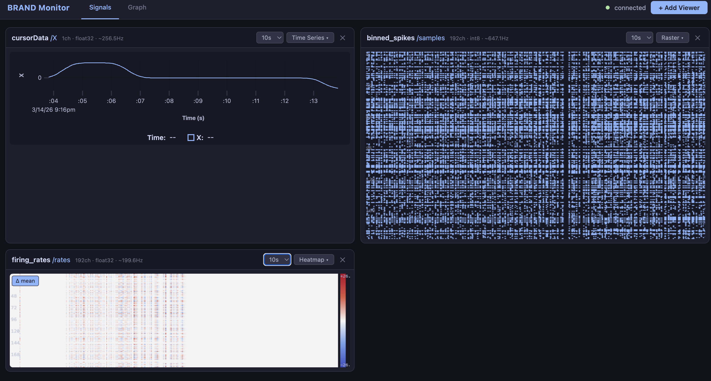
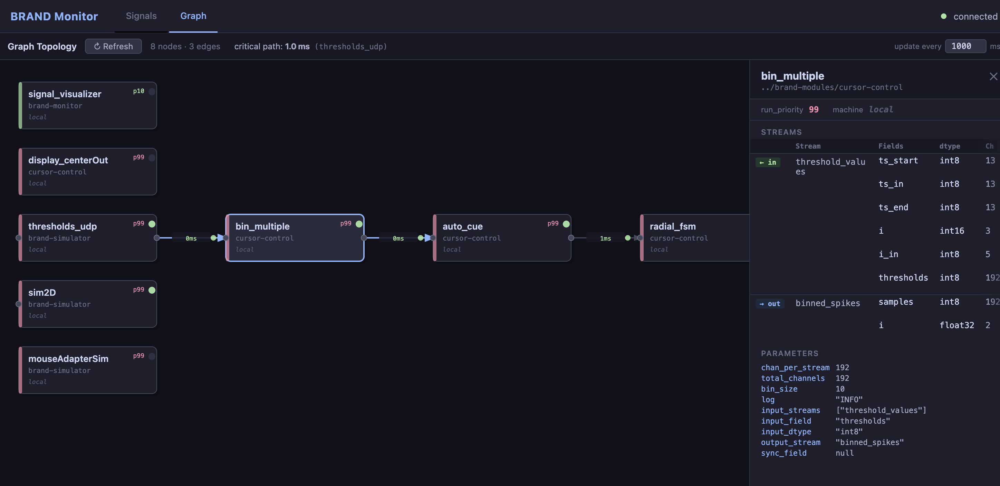

# brand-monitor

Real-time browser-based monitoring dashboard for [BRAND](https://github.com/brandbci/brand) graphs.

Runs as a standard BRAND graph node. Open `http://localhost:8765` in any browser while
a graph is running to monitor live signals and inspect graph structure without adding
meaningful overhead to the graph.





## Quick start

### 1. Add to your graph YAML

```yaml
nodes:
  - name: signal_visualizer
    nickname: signal_visualizer
    module: ../brand-modules/brand-monitor
    run_priority: 10
    parameters:
      port: 8765
      log: INFO
```

### 2. Build

```bash
make        # builds node + frontend (requires npm for frontend)
make node   # node only (no npm needed at runtime)
```

### 3. Run the graph

Start your graph normally with supervisor/booter. Then open:

```
http://localhost:8765
```

Click **+ Add Viewer**, select a stream and field, and choose a visualization type.

## Viewer types

### Timeseries
Scrolling line chart. For single-channel fields, each channel is plotted as a separate
line. For multi-channel fields only the first channel is plotted by default.

**Multi-field overlay**: when adding a viewer you can select multiple single-channel
fields from the same stream (e.g. `vel_x` + `vel_y`) — hold Shift or use the
checkboxes in the dialog. All selected fields are overlaid on one plot with a shared
legend and independent enable/disable toggles.

### Heatmap
2-D color image where rows are channels and time scrolls left-to-right.

- **Raw mode** (default): Plasma colormap — dark/purple = low, bright yellow = high.
- **Δ mean mode** (toggle button below the plot): subtracts a per-channel exponential
  moving average (τ = 10 s) so the display shows deviations from baseline rather than
  absolute values. Uses a dark-center diverging colormap (azure = below mean,
  red-orange = above mean; near-zero ≈ background). A tanh gain of 3× is applied so
  small deviations (~30% of the range) are already well into color — large outliers
  saturate smoothly rather than hard-clipping.

**Time window**: dropdown in the viewer title bar (5 / 10 / 20 / 30 s). The buffer
always holds 60 s of history so switching to a longer window immediately fills.

### Raster
Spike raster plot — one dot per threshold crossing event per channel. Suited for
sorted or unsorted spiking data (e.g. `binned_spikes`).

**Time window**: same dropdown as heatmap (5 / 10 / 20 / 30 s).

## Display refresh rate

The freshness numbers in the Graph view update at 600 ms by default (fast enough to
see activity, slow enough to read). Adjust via the **Refresh** input in the toolbar
or append `?refreshMs=N` to the URL (in ms, min 50). The setting is stored in the URL
so it survives page reload.

## Optional: display_hints in graph YAML

You can annotate streams with viewer hints. All existing tooling ignores this section.

```yaml
display_hints:
  binned_spikes:
    samples:
      viewer: raster
      y_label: "Channel"
  wiener_filter:
    samples:
      viewer: timeseries
      channel_labels: ["vel_x", "vel_y"]
```

## Frontend development

```bash
cd frontend
npm install
npm run dev     # starts Vite dev server with hot reload at http://localhost:5173
                # proxies /ws and /manifest to the running Python node on port 8765
```

## Architecture

See [docs/DESIGN.md](docs/DESIGN.md) for the full design document and
[docs/decisions/](docs/decisions/) for architecture decision records.

## Dependencies

Runtime: `fastapi`, `uvicorn`, `redis`, `numpy` (all present in the BRAND `rt` conda env
or installable via `pip install fastapi uvicorn`).

Frontend dev: Node.js 18+ and npm. Not required at runtime.
