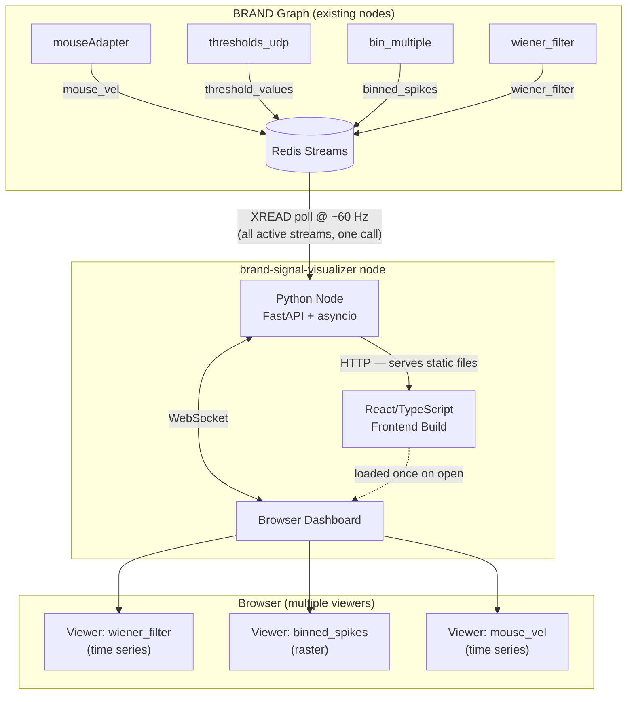

# brand-signal-visualizer — Design Document

## Overview

`brand-signal-visualizer` is a BRAND graph node that provides real-time browser-based
visualization of signals flowing through a BRAND graph. It runs as a standard node
alongside other graph nodes, reads from Redis streams, and serves a React/TypeScript
dashboard accessible at a localhost URL. Users can add multiple signal viewers,
each displaying a live stream, without meaningfully impacting the running graph.

## Goals

- Allow any Redis stream in a running BRAND graph to be visualized in a browser
- Add negligible computational overhead to the graph (the display node is a passive observer)
- Require no additional hardware — runs on the same machine as the graph
- Support multiple simultaneous viewers, each independently configured
- Be extensible to new signal types and viewer types without hard-coded stream names

## Non-Goals

- Recording or saving data (that is handled by the graph and NWB pipeline)
- Replacing the task display (e.g. `display_centerOut`) — this is a debugging/monitoring tool
- Providing closed-loop feedback into the graph
- Real-time analysis or processing of signals

---

## Architecture



The display node has two responsibilities:

1. **Redis bridge**: Polls all actively-viewed streams at display rate (~60 Hz) using a
   single batched `XREAD` call, then pushes new data to connected WebSocket clients.
2. **Static file server**: Serves the pre-built React frontend over HTTP so no separate
   web server is required.

---

## Backend

**Language and framework:** Python with FastAPI. This fits naturally into the BRAND
ecosystem (Python throughout, `redis-py` already a dependency) and FastAPI provides
clean async WebSocket support.

**Polling strategy:** The background thread calls `XREAD COUNT <n> STREAMS <s1> <s2>...`
once per display frame (~16 ms), reading all actively-viewed streams in a single Redis
round-trip. This bounds Redis overhead at ~60 calls/second regardless of the native
sample rate of any stream. For a 1000 Hz stream this means reading ~16 samples per
poll in one batch; for a 100 Hz stream, ~1–2 samples per poll.

No streams are polled if no browser is connected, and only streams with active viewers
are included in each poll. When the last viewer for a stream is closed, that stream
is dropped from the poll list immediately.

**Wire format:** Raw binary ArrayBuffers sent over WebSocket. Message layout:
```
type(1B) | stream_len(1B) | stream(N) | field_len(1B) | field(M) |
dtype_tag(1B) | n_channels(4B LE) | n_samples(4B LE) |
timestamps(n×8B uint64 LE, ms since epoch) | data(channels-first row-major)
```
Timestamps from Redis stream IDs are ms-precision uint64; the frontend converts to
seconds. Data is channels-first row-major (`data[ch * n_samples + s]`). See ADR-003.

**SIGINT shutdown:** The node overrides `terminate()` to set `server.should_exit = True`
and a `_shutdown` flag checked by the polling loop, allowing clean asyncio teardown
instead of the default `sys.exit(0)` which causes SIGKILL from the BRAND supervisor.

**Configuration (graph YAML `parameters` block):**
```yaml
- name: signal_visualizer
  nickname: signal_visualizer
  module: ../brand-modules/brand-signal-visualizer
  run_priority: 10          # deliberately low — not a real-time node
  parameters:
    port: 8765
    redis_host: localhost   # supports remote Redis for separate-machine use
    log: INFO
```

`run_priority: 10` ensures the OS scheduler deprioritizes this node relative to
real-time graph nodes (which typically run at priority 99).

---

## Frontend

**Stack:** React + TypeScript, built with Vite, committed as a pre-built static bundle
so users do not need `npm` to run the node. `npm` is a dev-time dependency only.

**Dashboard:** A free-form grid of viewer cards. Each card has:
- A header showing stream name, field, current sample rate, and viewer type selector
- A timescale dropdown (1 / 2 / 5 / 10 / 30 s) for time-series and heatmap viewers
- The visualization area
- A close button

**Add Viewer flow:**
1. User opens "Add Viewer" dialog
2. Backend sends a stream manifest on connect (stream names, field names, dtype, shape,
   approximate current rate — inferred from the last Redis entry)
3. User selects a stream and field
4. Frontend pre-selects the default viewer type based on shape/dtype rules (see below)
5. User can override the viewer type before confirming
6. Viewer appears; type can be changed at any time via the card toolbar

**Viewer types (MVP):**

| Type | Compatible when | Default for |
|---|---|---|
| Time series | Any signal, ≤ 16 channels | 1–16 ch float or int |
| Raster | Multi-channel, int/binary-ish | > 16 ch int8/int16 |
| Heatmap | Multi-channel, continuous | > 16 ch float |
| Scatter / 2D | Exactly 2 channels, continuous | — (optional override) |
| Gauge | Any, 1 channel | — (optional override, not yet implemented) |

Viewer type is determined by signal shape and dtype — **never by stream name**.
Switching type is a frontend-only operation with no backend round-trip.

**Charting libraries:**
- Time series: [uPlot](https://github.com/leeoniya/uPlot) — purpose-built for
  high-frequency time series, handles large typed arrays at 60 fps efficiently
- Raster and heatmap: direct Canvas 2D API with `putImageData` for performance

---

## Viewer Implementation Notes

### Time Series Viewer

Uses uPlot with a `scales.x.range` function that always displays exactly `windowSecs`
of data anchored to the latest sample. The range function reads from a mutable ref
(`windowSecsRef`) so the timescale dropdown updates take effect immediately without
destroying and re-creating the uPlot instance.

The data buffer retains up to `MAX_BUFFER_SECS = 60` seconds of history (hard cap
derived from `approx_rate_hz × 60 × 1.5` to accommodate high-rate streams like
1000 Hz neural data). This means switching to a wider time window reveals real past
data rather than an empty plot.

### Raster Viewer

Canvas 2D rendering with a `requestAnimationFrame` loop. Stores events as
`{ ts, ch }` pairs; renders dots at `(x, y)` coordinates mapped from time and channel.
Suitable for sparse binary spike trains on > 16 channels.

### Heatmap Viewer

Canvas 2D rendering with `putImageData` for efficient pixel-level control. Each
time column maps to one or more canvas pixel columns; each channel maps to
`pxPerCh` rows (`max(1, floor(200 / n_channels))` so total height ≈ 200 px
regardless of channel count).

**Colormaps:**
- Default (raw mode): Plasma (dark purple → orange → yellow, 0 = low, max = bright)
- Demeaned mode: Diverging RdBu (blue = below mean, white = zero, red = above mean)

**Demeaning ("Δ mean" toggle):** A per-channel 10-second exponential moving average
(EMA) is maintained continuously. When the toggle is active, `value − EMA` is
displayed using the diverging colormap, making channel-to-channel firing rate
modulations visible even when baseline rates differ substantially across channels.
EMA is initialized to the first sample's values to avoid a slow warmup transient.

The adaptive color scale decays slowly (`rangeMax * 0.98 + dataMax * 0.02`) to
prevent the display from flashing when occasional outlier values occur.

---

## Signal Types in the Simulator Graphs

| Stream | Shape | dtype | Rate | Default viewer |
|---|---|---|---|---|
| `mouse_vel` | 3 | int16 | 200 Hz | Time series |
| `firing_rates` | 192 | float32 | 200 Hz | Heatmap |
| `threshold_values` | 192 | int8 | 1000 Hz | Raster |
| `binned_spikes` | 192 | int8 | 100 Hz | Raster |
| `wiener_filter` | 2 | float32 | 100 Hz | Time series |
| `control` | 2 | float32 | 100 Hz | Time series |
| `cursorData` | 2 | float32 | task-driven | Time series |
| `targetData` | 2 | float32 | task-driven | Time series |

---

## Graph YAML Integration

The node is added to any graph YAML like any other node. An optional top-level
`display_hints` section can annotate streams with viewer overrides and channel labels.
All existing tooling ignores this section; it is purely advisory for the display node.

```yaml
display_hints:
  binned_spikes:
    samples:
      viewer: raster
      y_label: "Channel"
  wiener_filter:
    samples:
      viewer: timeseries
      channel_labels: ["vel_x", "vel_y"]
  firing_rates:
    samples:
      viewer: heatmap
      y_label: "Neuron"
```

If `display_hints` is absent, defaults are inferred from shape and dtype.

---

## Computational Overhead Strategy

The display node is designed to be a **rate-limited passive observer**:

- One `XREAD` call per display frame covers all active streams simultaneously
- Polls only streams with active browser viewers; idles completely when no browser is connected
- Runs at low OS scheduler priority (`run_priority: 10` vs 99 for real-time nodes)
- Does not use `SCHED_FIFO` — standard `SCHED_OTHER` only
- Wire format is binary to minimize serialization CPU cost
- No stream entries are acknowledged or consumed (no consumer groups) — purely read-only,
  no effect on stream trimming or other consumers

---

## Implementation Status

### Completed ✓

- Python node: FastAPI + asyncio server, WebSocket endpoint, Redis polling loop
- Stream manifest: auto-discovers all Redis streams on connect, infers dtype/shape/rate
- Binary wire format with correct TypedArray alignment (buffer-slice before view construction)
- Time series viewer (uPlot, scrolling window, timescale dropdown 1–30 s, 60 s history buffer)
- Raster viewer (Canvas 2D, scrolling spike-dot plot)
- Heatmap viewer (Canvas 2D `putImageData`, plasma colormap, per-channel EMA demeaning toggle)
- Add/remove viewers dynamically
- Viewer type toggle (frontend only, no backend round-trip)
- `display_hints` parsing from graph YAML
- macOS + Linux support
- Pre-built React bundle committed to repo (`nodes/signal_visualizer/static/`)
- SIGINT clean shutdown (no SIGKILL from supervisor)
- Added as a git submodule in `brand-tutorial/brand-modules/brand-signal-visualizer`
- Environment YAML dependencies: `fastapi>=0.100.0`, `uvicorn[standard]>=0.23.0`
- Shell launcher `.bin` file (skips Cython compilation step)

### Known Limitations / Post-MVP

- **Scatter / 2D viewer**: placeholder only ("coming soon")
- **Gauge viewer**: placeholder only ("coming soon")
- **Multi-field viewers**: each viewer card subscribes to a single stream field;
  overlaying multiple fields in one card is not yet supported
- **Data backfill on viewer open**: new viewers show only live data from the moment
  they are added; no historical replay from Redis stream history
- **Viewer layout persistence**: configured viewers are lost on browser refresh
- **Remote Redis**: `redis_host` parameter exists but is untested across machines

---

## Open Questions (TBD)

- **Backfill on viewer open**: When a viewer is added mid-session, should it receive
  historical data from the Redis stream (Redis stores a configurable history), or only
  live data going forward? Backfill improves usability but adds complexity.
- **Viewer state persistence**: Should configured viewers survive a browser refresh?
  (`localStorage` is available since this is a standalone app, not an artifact.)
- **Multi-field viewers**: Allow a single time series card to overlay multiple fields
  from the same stream (e.g. both `vel_x` and `vel_y` on one plot)?
- **npm as dev dependency**: Is npm acceptable as a requirement for frontend development?
  The pre-built bundle avoids it at runtime, but contributors modifying the frontend need it.
