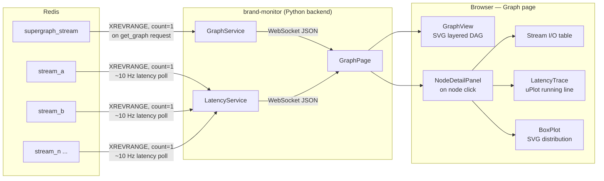

# BRAND Graph Visualizer — Design Document

## Overview

The Graph Visualizer is a second page within `brand-monitor` that displays
the structure of the currently running BRAND graph in a browser. It shows nodes as
boxes arranged left-to-right in data-flow order, with edges representing shared Redis
streams connecting them. Clicking a node reveals its input/output streams (including
field names and dtypes), and live latency measurements with a running trace and
distribution plot.

The feature requires no changes to any other BRAND node and introduces no new
dependencies for the graph itself — it reads the same Redis data that the supervisor
and nodes already publish.

---

## Goals

- Display the full node topology of the running graph at a glance
- For each node, show which Redis streams it reads from and writes to, and the schema
  (fields, dtypes, channel count, approximate rate) of those streams
- Measure and display processing latency per node, both as a running trace and as a
  statistical distribution
- Require zero changes to existing graph nodes or YAML files

## Non-Goals

- Modifying or reconfiguring the running graph
- Controlling graph execution (start/stop/restart nodes)
- Replacing the BRAND supervisor UI

---

## Integration Point

The Graph Visualizer is a **second page** inside `brand-monitor`. The React
frontend gains a tab bar (Signal Viewer | Graph), and the Python backend gains two
new WebSocket message handlers. No new node, port, or service is needed.

---

## Architecture



---

## Backend

### Topology Discovery

On a `get_graph` WebSocket request from the browser, the backend:

1. Reads the latest entry from `supergraph_stream` with `XREVRANGE count=1`.
   The entry contains the serialized graph YAML under a known field key.
2. Parses the YAML into a node list. Each node record has `nickname`, `name`,
   `module`, `run_priority`, and `parameters`.
3. Calls `SCAN` (or `KEYS *`) to enumerate all live Redis stream names.
4. For each node, walks its `parameters` dict recursively and collects any string
   values (or list-of-string values) that exactly match a live Redis stream name.
   These are the node's candidate I/O streams.
5. Classifies streams as **input** or **output** using a two-pass heuristic:
   - A stream that is a candidate for node A and also a candidate for node B creates
     a directed edge A → stream → B.
   - If a stream appears as a candidate in only one node, it is labelled as a source
     (unknown upstream) or sink (unknown downstream).
   - Since many BRAND nodes follow a naming convention (`in_stream` / `out_stream`
     / `streams` keys), the parameter key name is used as a strong hint when present.
6. Augments each stream entry with its schema from the stream manifest (dtype,
   n_channels, fields, approximate rate) — reusing the same manifest-building
   logic already in `signal_visualizer.py`.
7. Returns a `graph_topology` WebSocket message (see Protocol section).

The topology is rebuilt on each `get_graph` request (and optionally re-sent if the
supergraph changes). It is **not** polled continuously — the graph structure is
static during a run.

### Latency Measurement

All measurements are derived purely from Redis stream entry IDs (millisecond
timestamps) — no changes to existing BRAND nodes are required.

#### Stream freshness (Phase 2a)

For every stream in the topology:

```
freshness_ms = now_ms − latest_entry_id_ms
```

Freshness is the age of the most recent entry. Compared to the stream's expected
inter-sample interval (`1000 / approx_rate_hz`), it indicates whether the producing
node is currently running:

| Freshness | Interpretation |
|---|---|
| < 2× interval | Healthy — node is running on schedule |
| 2–10× interval | Stale — node may be slow or intermittent |
| > 10× interval | Dead — node appears to have stopped |

Freshness is displayed as a colored dot on each node box (green / yellow / red)
and as a `ms` age label on each edge. It works for all node types including
source nodes (output streams only) and sink/display nodes (input streams only),
for which cross-stream latency is not computable.

#### Processing latency (Phase 2b)

For nodes with at least one input stream and one output stream:

```
latency_ms = output_stream_id_ms − max(input_stream_id_ms)
```

`output_stream_id_ms` is the Redis timestamp of the latest entry in the node's
primary output stream. `input_stream_id_ms` is the same for each input stream;
the maximum across inputs is used (the last input to arrive in that cycle).

For multi-output nodes, latency is computed independently per output stream and
the minimum is reported (the output produced soonest after input).

**Node type handling:**

| Node type | Example | Latency measurable? |
|---|---|---|
| Transform (in → out) | bin_multiple, wiener_filter | Yes |
| Source (out only) | mouseAdapter, thresholds_udp | No — freshness only |
| Sink (in only) | display_centerOut | No — freshness only |
| Batch (N in → 1 out) | bin_multiple (10:1) | Yes — includes accumulation window |

**Limitations:** Accurate to ~1 ms (Redis ID resolution). For batch nodes, the
reported latency includes the accumulation window (e.g. bin_multiple at 10 ms
bins will report ~10 ms minimum), which is correct for end-to-end purposes but
larger than the node's pure compute time.

#### End-to-end / critical path latency (Phase 2b)

The cumulative latency along the DAG's critical path (the path with the highest
sum of per-edge latencies) is the clinically meaningful end-to-end delay — from
raw neural data to decoder output. Displayed in the graph toolbar as:

```
critical path: 14.2 ms  [node_a → bin_multiple → wiener_filter]
```

#### Jitter (Phase 2b)

For each output stream, the standard deviation of the last N inter-sample
intervals is computed alongside latency. High jitter (relative to the mean
interval) indicates OS scheduling variance or variable-length processing.

### LatencyService

A background asyncio coroutine running at ~10 Hz (100 ms interval):

1. For each stream in the topology, calls `XREVRANGE <stream> + - COUNT 2`
   (2 entries to compute the inter-sample interval).
2. Computes `freshness_ms`, `latency_ms` (where applicable), and
   `interval_std_ms` (jitter) per node.
3. Appends latency samples to a per-node ring buffer
   (2 min × 10 Hz = 1 200 samples).
4. Pushes a `latency_update` WebSocket message to all subscribed clients.

### New WebSocket Messages

**Client → Server:**

| Message type | Payload | Description |
|---|---|---|
| `get_graph` | — | Request full topology + current stream schemas |
| `subscribe_graph_latency` | — | Start receiving `latency_update` messages |
| `unsubscribe_graph_latency` | — | Stop receiving latency updates |

**Server → Client:**

| Message type | Payload | Description |
|---|---|---|
| `graph_topology` | See below | Full node/edge/stream schema snapshot |
| `latency_update` | See below | Per-node latency batch (~10 Hz) |

**`graph_topology` payload:**
```json
{
  "type": "graph_topology",
  "nodes": [
    {
      "nickname": "bin_multiple",
      "name":     "bin_multiple",
      "module":   "brand-modules/bin_multiple",
      "run_priority": 99,
      "in_streams":  ["threshold_values"],
      "out_streams": ["binned_spikes"],
      "parameters":  { "bin_size": 20 }
    }
  ],
  "streams": {
    "binned_spikes": {
      "samples": {
        "dtype": "int8", "n_channels": 192,
        "approx_rate_hz": 100, "suggested_viewer": "raster"
      }
    }
  },
  "edges": [
    { "from": "bin_multiple", "to": "wiener_filter", "stream": "binned_spikes" }
  ]
}
```

**`latency_update` payload:**
```json
{
  "type": "latency_update",
  "t": 1234567890.123,
  "freshness": {
    "binned_spikes":    3.1,
    "threshold_values": 2.8
  },
  "latency": {
    "bin_multiple":  12.3,
    "wiener_filter":  5.2
  },
  "jitter": {
    "bin_multiple":  0.4,
    "wiener_filter": 0.1
  },
  "critical_path_ms":    17.4,
  "critical_path_nodes": ["mouseAdapterSim", "thresholds_udp", "bin_multiple", "wiener_filter"]
}
```

Phase 2a sends the **latest** latency scalar per node. Phase 2b will extend this with
the full ring-buffer history for use by `LatencyTrace` and `LatencyBoxPlot`.

---

## Frontend

### Navigation

A minimal tab bar is added to the top of the existing dashboard:

```
[ Signal Viewer ]  [ Graph ]
```

Tab state is managed in `App.tsx` with a simple `activePage` string — no React
Router is needed given there are only two pages.

### Graph View (`GraphView.tsx`)

An SVG-based layered DAG rendered inside a scrollable `div`. Layout algorithm:

1. **Topological sort** of nodes using Kahn's algorithm (the graph is a DAG by
   construction — BRAND graphs have no feedback within a single processing cycle).
2. **Layer assignment**: each node's layer = longest path from any source node to
   that node (critical path depth). Sources are layer 0.
3. **Within-layer ordering**: nodes in the same layer are stacked vertically and
   sorted to minimize edge crossings (a single-pass barycentric heuristic is
   sufficient for typical graph sizes of 5–20 nodes).
4. **Coordinates**: `x = layer × LAYER_STRIDE`, `y` evenly distributed within layer.
5. **Edges**: cubic Bézier curves from the right edge of the source node rectangle
   to the left edge of the target, labelled with the stream name near the midpoint.
6. **Unknown sources/sinks**: streams with no detectable upstream/downstream node
   are rendered as small circular input/output ports at the graph boundary.

Node boxes display: `nickname`, module short name, `machine` hostname, run_priority
badge. Phase 2a adds a freshness dot (green/yellow/red) and Phase 2b adds a median
latency badge (e.g. `8ms`). Edge labels show stream name (Phase 1) and latency
(Phase 2b).

### Node Detail Panel (`NodeDetailPanel.tsx`)

Slides in from the right when a node is clicked. Contains:

**Header** — nickname, module, machine, run_priority badge.

**Streams I/O table**

| Direction | Stream | Fields | dtype | Ch | Rate | Freshness |
|---|---|---|---|---|---|---|
| ← in | `threshold_values` | `samples` | int8 | 192 | 1000 Hz | 1.2 ms ● |
| → out | `binned_spikes` | `samples` | int8 | 192 | 100 Hz | 3.4 ms ● |

(Phase 2a adds the Freshness column. Dot color follows green/yellow/red scale.)

**Latency trace** (Phase 2b) — a uPlot line chart showing the last 60 seconds of
per-node latency samples. Built using a lightweight uPlot instance with synthetic
data constructed from `latency_update` messages (not a full `TimeSeriesViewer`).

**Latency distribution** (Phase 2b) — SVG box-and-whiskers over all retained
samples (up to 2 minutes). Displays: p5 whisker, p25 box edge, median line,
p75 box edge, p95 whisker, plus individual outlier dots. A KDE curve is overlaid
when ≥ 50 samples are available (kernel density, 30 buckets). X-axis in ms,
auto-scaled to p99 × 1.1.

**Jitter summary** (Phase 2b) — single-line stat bar: `median Xms · p95 Xms · jitter ±Xms`.

### No-selection summary (Phase 2b)

When no node is selected, the detail panel area shows a horizontal bar chart
ranking all nodes by median latency — highlighting the bottleneck at a glance.

### Latency Distribution Chart (`LatencyBoxPlot.tsx`)

Pure SVG component. Given an array of latency samples (ms), renders:
- A horizontal box spanning p25–p75, with a vertical median line
- Whiskers to p5 and p95, with small caps
- Individual outlier dots beyond p5/p95
- Optional KDE curve overlaid as a filled path
- X-axis in milliseconds, auto-scaled to [0, p99 × 1.1]

---

## Data Flow Summary

```
Page load
  └─► App sends get_graph
        └─► Backend reads supergraph_stream, scans Redis streams
              └─► Returns graph_topology
                    └─► GraphView renders SVG DAG

User clicks node
  └─► NodeDetailPanel opens
  └─► App sends subscribe_graph_latency (if not already subscribed)
        └─► Backend starts 10 Hz latency poll
              └─► latency_update messages arrive
                    └─► LatencyTrace updates (uPlot)
                    └─► LatencyBoxPlot re-renders (SVG)

User closes panel / navigates away
  └─► App sends unsubscribe_graph_latency
```

---

## Implementation Plan

### Phase 1 — Topology display ✅ complete

- [x] Backend: `_build_graph_topology()` — reads `supergraph_stream`, scans Redis,
      infers I/O via parameter key heuristic
- [x] Backend: `get_graph` WebSocket handler with YAML format fallback
- [x] Frontend: `GraphPage.tsx`, `GraphView.tsx` (SVG DAG), `NodeDetailPanel.tsx`
- [x] Tab bar in `App.tsx`; `machine` field on node boxes and detail panel

### Phase 2a — Stream freshness ✅ complete

- [x] Backend: `_latency_loop()` coroutine at 10 Hz — computes `freshness_ms` per
      stream via `XREVRANGE count=2`; sends `latency_update` with freshness dict
- [x] Backend: `subscribe_graph_latency` / `unsubscribe_graph_latency` handlers
- [x] Frontend: freshness dot on each node box (green/yellow/red)
- [x] Frontend: freshness age label on each DAG edge
- [x] Frontend: Age column in NodeDetailPanel streams table
- [x] Frontend: critical path latency in GraphPage toolbar
- [x] Frontend: display refresh rate control — URL param `?refreshMs=N` (default 600 ms)
      plus a numeric input in the toolbar; updates URL via `replaceState` so the
      setting survives page reload
- [x] Frontend: scroll-fade indicator on NodeDetailPanel streams table — a right-edge
      gradient overlay appears whenever the table overflows horizontally, and fades out
      once the user scrolls to the end

### Phase 2b — Processing latency history

- [ ] Backend: extend `LatencyService` with per-node latency computation,
      ring buffer (1 200 samples), jitter (interval std dev), critical path sum
- [ ] Frontend: `LatencyTrace` — lightweight uPlot line chart in NodeDetailPanel
- [ ] Frontend: `LatencyBoxPlot.tsx` — SVG box-and-whiskers + KDE overlay
- [ ] Frontend: jitter stat bar in NodeDetailPanel
- [ ] Frontend: critical path latency in GraphPage toolbar
- [ ] Frontend: no-selection summary bar chart (all nodes ranked by median latency)
- [ ] Frontend: latency ms badge on node boxes; latency label on edges

### Phase 3 — Polish

- [ ] Handle unknown sources/sinks gracefully (boundary ports on graph edge)
- [ ] Auto-refresh topology when `supergraph_stream` gets a new entry
- [ ] Edge latency coloring (green/yellow/red alongside stream name label)

---

## Open Questions

- **Parameter heuristic accuracy**: For nodes with non-standard parameter naming, the
  stream-name matching heuristic may miss connections or produce false edges. A
  `graph_hints` top-level YAML section (analogous to `display_hints`) could allow
  explicit override — deferred to Phase 3.
- **Multi-output nodes**: Some nodes may write to several output streams. The latency
  definition above picks the primary output; we need to decide which stream is
  "primary" (lowest latency? highest rate? first listed?).
- **Supervisor node**: The supervisor itself may appear as a node in the topology.
  Should it be shown, hidden, or rendered differently?

## Resolved

- **supergraph_stream field key**: The supervisor stores the graph YAML as a
  JSON-encoded string in the `data` field of the `supergraph_stream` entry (i.e.
  the value is a JSON string whose content is YAML text — double-encoded). The
  backend applies a three-format fallback: (a) JSON → dict directly, (b) JSON →
  string → `yaml.safe_load()`, (c) raw bytes → `yaml.safe_load()`.
